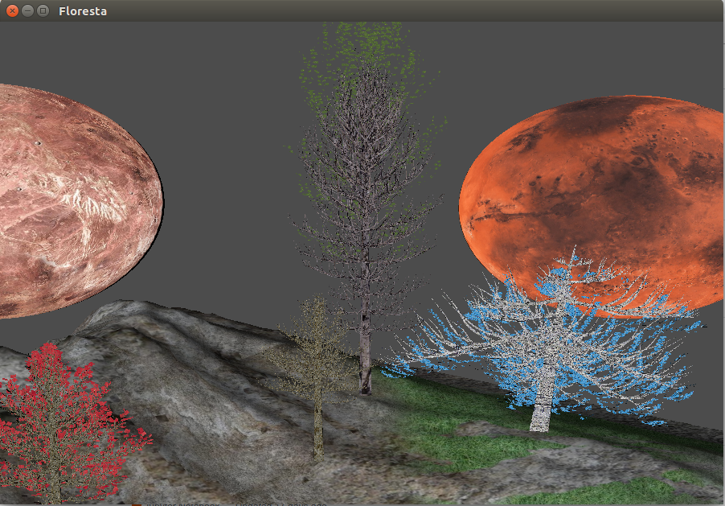

# Projeto Blender

Criar modelo 3D com materiais e texturas com Blender e OpenGL. Renderizar e criar sistema de navegação.

## Executar

`python cena.py`

Obs: Instale as depedências do Python.

+ `w`: cima
+ `a`: baixo
+ `d`: direita
+ `s`: esquerda
+ `p`: luz 1
+ `o`: luz 2

## Execução

