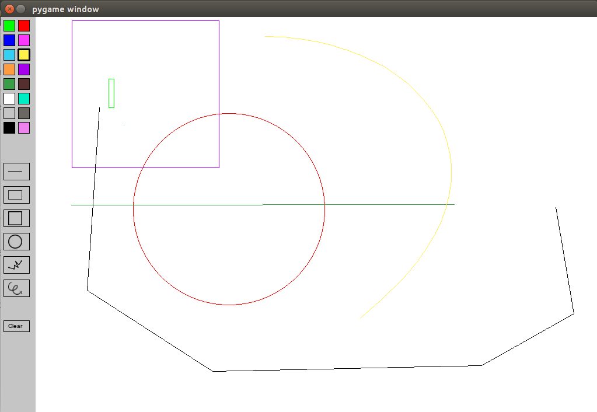

# Trabalho de Computação Gráfica

*Matéria:* BCC GBC204 - Computação Gráfica - UFU 2019.1

## Grupo

+ Rafael Morais de Assis
+ Bruno Borges

## Descrição do Trabalho

Neste trabalho a equipe deve desenvolver um aplicativo de desenho gráfico a semelhança do MS-paint.
+ O usuário deve selecionar entre as ferramentas de desenho:
  1. linha, retângulo, quadrado, círculo, polilinha, curva (Bezier ou Spline);
  2. seleção de cores: fornecer ao usuário uma paletta de pelo menos 16 cores;
  3. ferramenta de preenchimento;
+ a rotina de desenho de linhas devem implementar necessariamente o algoritmo de
Breseham e para círculos o algoritmo do ponto médio;
+ Retângulos, quadrados e polilinhas devem ser produzidos usando o algoritmo de linha
supracitado; 

## Instruções de Uso

Execute com o comando `python paint.py`. É necessário ter a lib pygame.

+ Semelhante a ferramentas de Paint
+ Para RETA, RETANGULO, QUADRADO e CIRCULO, clique com um dos botoes do mouse e arraste (mantena clicado) para a geraçâo da imagem. A imagem é gerado quando você solta o clicl
+ Para a POLILINHA: VOcê aperta com o botao esquerdo para fazer `n` polilinhas em seguencia e o BOTÃO DIREITO DO MOUSE para SAIR
+ Para CURVA: é necessário aperta 5 vezes COM O BOTÂO DIREITO, as 4 ultimas geram 4 pontos para se fazer o Bezier. Apos aparecer a curva você pode arrastar os pontos com O BOTÃO ESQUERDO e modificar a curva
  + Para sair da ferramenta de CURVA aperte alguma tecla como `Ctrl` ou `down`
  
## Funcionamento
  

